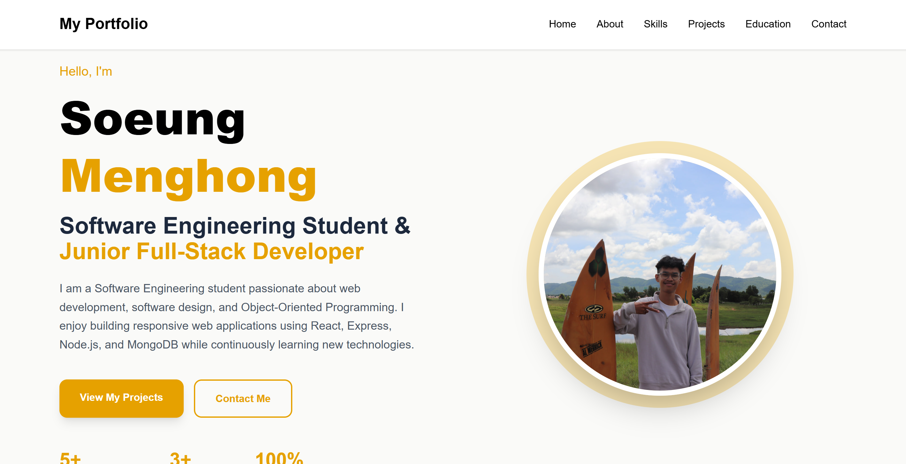
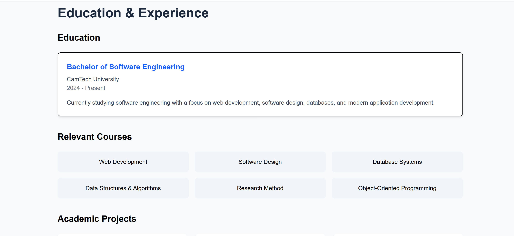
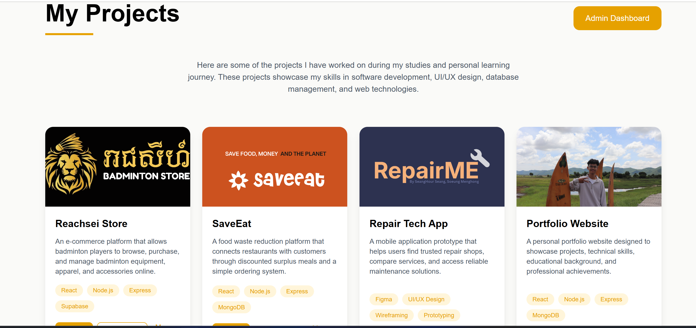
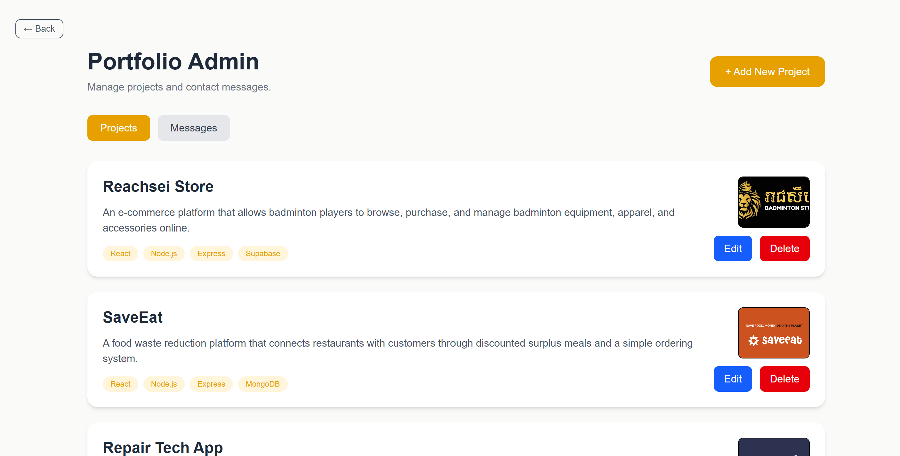

# Personal Portfolio Website

## Project Overview

This project is a full-stack Personal Portfolio Website developed to showcase my skills, education, achievements, and software development projects. The website provides visitors with information about my background and allows them to explore my completed projects. An Admin Dashboard is included to manage portfolio projects dynamically without modifying source code.

---

## Main Features

### Visitor Features

- View personal profile and introduction
- Browse portfolio projects
- View project details
- View skills and education information
- Contact form for sending messages
- Responsive design for desktop and mobile devices

### Admin Features

- Admin login authentication
- Add new projects
- Edit existing projects
- Delete projects
- View contact messages

---

## Technologies Used

### Frontend

- React.js
- Vite
- Tailwind CSS
- React Router DOM
- Axios

### Backend

- Node.js
- Express.js
- JWT Authentication

### Database

- MongoDB Atlas

### Deployment

- AWS EC2
- Nginx
- PM2

### Version Control

- Git
- GitHub

---

## Application Architecture

```text
Client Browser
      │
      ▼
React Frontend (Vite + Tailwind)
      │
      │ REST API
      ▼
Express Backend (Node.js)
      │
      ▼
MongoDB Atlas Database
```

---

## Installation Instructions

### Clone Repository

```bash
git clone <repository-url>
cd portfolio-website
```

### Install Frontend Dependencies

```bash
cd frontend
npm install
```

### Install Backend Dependencies

```bash
cd backend
npm install
```

---

## Environment Variable Instructions

Create a `.env` file inside the backend folder.

Example:

```env
MONGO_URI=your_mongodb_connection_string
PORT=5000
ADMIN_PASSWORD=your_admin_password
JWT_SECRET=your_jwt_secret
```

Do not commit actual secret values to GitHub.

---

## Running the Frontend

Navigate to frontend folder:

```bash
cd frontend
```

Start development server:

```bash
npm run dev
```

Default URL:

```text
http://localhost:5173
```

---

## Running the Backend

Navigate to backend folder:

```bash
cd backend
```

Start development server:

```bash
npm run dev
```

Default URL:

```text
http://localhost:5000
```

---

## API Endpoint Summary

### Projects

| Method | Endpoint | Description |
|----------|------------|------------|
| GET | /api/projects | Get all projects |
| GET | /api/projects/:id | Get project by ID |
| POST | /api/projects | Create project |
| PUT | /api/projects/:id | Update project |
| DELETE | /api/projects/:id | Delete project |

### Messages

| Method | Endpoint | Description |
|----------|------------|------------|
| GET | /api/messages | Get all messages |
| POST | /api/messages | Submit contact message |

### Admin

| Method | Endpoint | Description |
|----------|------------|------------|
| POST | /api/hongpanel/login | Admin login |

---

# Portfolio Website Screenshort

## Home Page



## Education Section



## Projects Section



## Admin Dashboard



## Live Website URL

**Live Website:**

http://3.106.218.13

---

## GitHub Repository URL

**GitHub Repository:**

https://github.com/honggoodboy/hongportfolio

---

## Known Limitations

- Single administrator account
- No image upload functionality
- No email notification system
- Basic authentication implementation
- Limited analytics and reporting

---

## Future Improvements

- Role-based authentication
- Image upload and management
- Project search and filtering
- Email notifications
- Dark mode support
- HTTPS implementation
- Docker deployment
- Analytics dashboard
- Multi-admin support

---

## Author Information

**Name:** Soeung Menghong

**Program:** Software Engineering

**University:** CamTech University

**Project Type:** Web Development Final Project

**Year:** 2026

---

## License

This project was developed for educational purposes as part of a university coursework project.
